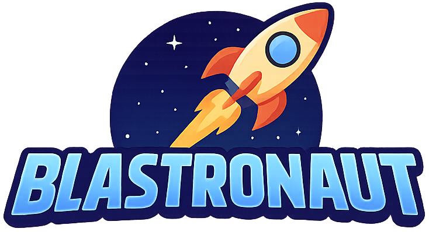

<p align="center">
  
</p>

# 🚀 Blastronaut

**A cosmic arcade shooter where you pilot a lone rocket through endless waves of asteroids. Blast or be blasted.**

---

## 🎮 Gameplay

- 🧑‍🚀 Control your rocket with **WASD**
- 🎯 Aim and rotate with the mouse
- 🔫 Left-click to shoot
- 💥 Dodge incoming asteroids
- 🧱 Survive as long as you can while racking up points
- ❤️ 3 lives, and you're toast!

---

## 💻 How to Run

1. Clone the repo  
   ```bash
   git clone https://github.com/your-username/blastronaut.git

2. Open the project in Unity 2021.3 LTS or newer

3. Load the Tutorial scene

4. Press ▶️ Play and start blasting!
